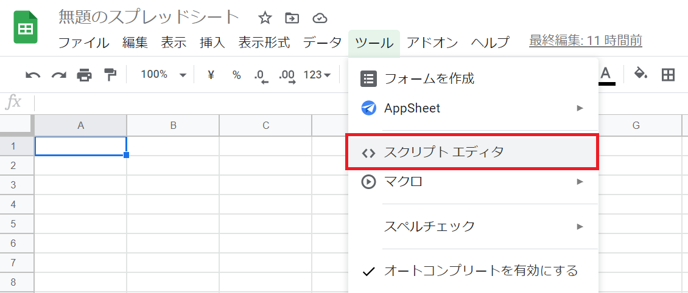
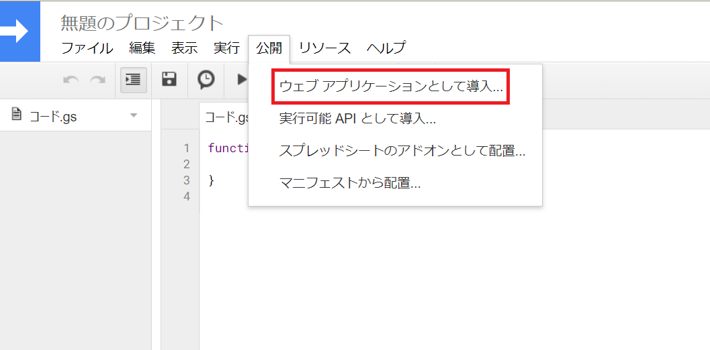
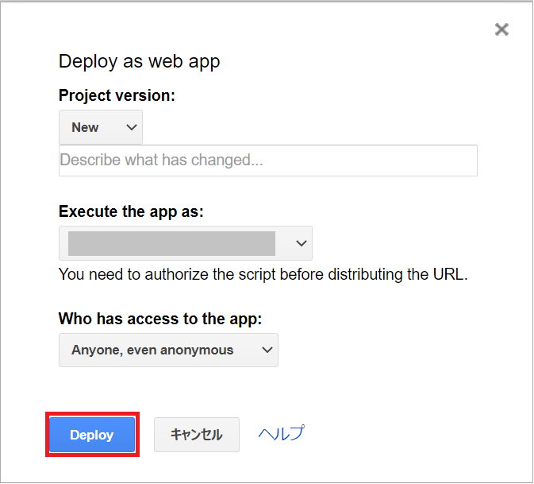
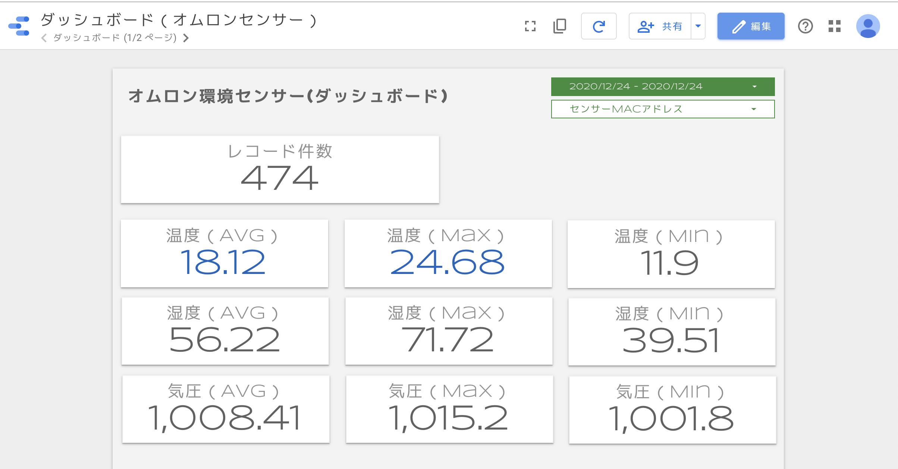

# オムロン環境センサー（2JCIE-BL01）のデータを取得
Raspberry-pi でオムロン環境センサー（2JCIE-BL01）のデータを取得した際のスクリプト一式。
以下 Qiita の記事を参考に、取得したデータは Google スプレッドシートにアップロードしデータポータルで可視化する。

[Omron環境センサの値をRaspberryPiで定期ロギングする](https://qiita.com/c60evaporator/items/ed2ffde4c87001111c12)

記事の内容がわかりやすくとても参考になりました。

## 環境
- Raspberry-pi Pi 4 Computer Model B 4GB RAM
- Python 3.7.3


## セットアップ
### Raspberry-pi 
パッケージ `libglib2.0-dev` のインストール

```bash
$ sudo apt install libglib2.0-dev
```

`bluepy` のインストールし `bluepy-helper` に sudo を許可。
``` bash
$ pip install bluepy
$ cd `pip3 show bluepy | grep "^Location:" | sed -e 's/^Location://' -e 's/^ //' -e 's/ $//'`/bluepy
$ sudo setcap 'cap_net_raw,cap_net_admin+eip' bluepy-helper
```  
  
### Google スプレッドシート
取得したオムロンのセンサーデータは、参考にさせてもらった Qiita の記事同様に Google スプレッドシートにアップロード。以下、備忘録もかねて手順をメモ。  
  
[ツール]-[スクリプトエディター] を選択。

  
  
新規プロジェクトを作成し、以下の `doPost` 関数を記入。  
対象のオムロンセンサーのデータのみ、Google スプレッドシートに追記される。
```Javascript

var spreadsheetId = '<スプレッドシートIDを記載>'
var sensorList = ['<オムロンセンサー MACアドレスを記載>'];

function doPost(e){
  var data = [
    e.parameter.Date_Master,     
    e.parameter.Date, 
    e.parameter.MacAddress, 
    e.parameter.SensorType,
    e.parameter.Temperature,    
    e.parameter.Humidity,  
    e.parameter.Light,  
    e.parameter.UV,  
    e.parameter.Pressure, 
    e.parameter.Noise,  
    e.parameter.BatteryVoltage,   
    new Date(),   
  ];
  //取得したデータをログに記載
  Logger.log(new Date());
  //スプレッドシートへのデータ行出力
  addData(data);  
  return ContentService.createTextOutput("OK");
}

//スプレッドシートへのデータ出力
function addData(data){
  //list にある MAC アドレスのセンサーデータのみスプレッドシートに追記
  if (sensorList.indexOf(data[2]) != -1) {
    var sheet = SpreadsheetApp.openById(spreadsheetId).getSheetByName('DATA');
    sheet.appendRow(data);
  }
};
```
  
[公開] - [ウェブアプリケーションとして導入] を選択し、WEB アプリとしてデプロイ。  
データの POST 先 URL を取得（コピーしておく）
  

  
  
  
## スクリプトの実行
スクリプトファイル一式をダウンロード。  
``` bash
$ git https://github.com/tsunao8989/omron-environment-sensor.git
$ cd omron-environment-sensor
```
  
setting.ini の `POST_URL` に取得した URL を追記
``` bash
$ vi setting.ini

[DEFAULT]
OUTPUT_DIR = /home/pi/log
OUTPUT_FILENAME = omron_data.log
BLE_RETRY = 3
BLE_SCAN_TIME = 5.0
REQUEST_RETRY = 5
REQUEST_TIMEOUT = [10.0, 30.0]
REQUEST_FACTOR = 10
REQUEST_FORCELIST = [500, 502, 503, 504]

[GOOGLE_API]
POST_URL = <Your URL> << ここに追記
```
  
Python スクリプト `omronEnvCollect.py` の実行
``` bash
$ python omronEnvCollect.py
# Debug
$ python omronEnvCollect.py -d
# Write CSV File
$ python omronEnvCollect.py -w
```
  
  
## その他
Google データポータルで好きなようにダッシュボードを作れるので便利！  
おうちの IoT 化 (´・ω・`)v" ﾁｮｷ!
  

